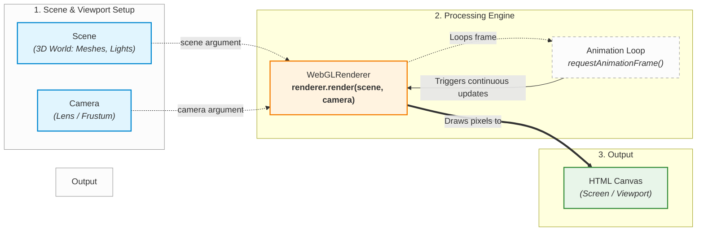

# three

http://mnl.space/three

## chart
render a scene with a camera

```mermaid
flowchart LR
    subgraph Setup ["1. Scene & Viewport Setup"]
        direction TB
        Scene["Scene<br/><i>(3D World: Meshes, Lights)</i>"]
        Camera["Camera<br/><i>(Lens / Frustum)</i>"]
    end

    subgraph Engine ["2. Processing Engine"]
        Renderer["WebGLRenderer<br/><b>renderer.render(scene, camera)</b>"]
        Loop["Animation Loop<br/><i>requestAnimationFrame()</i>"]
    end

    subgraph Display ["3. Output"]
        Canvas["HTML Canvas<br/><i>(Screen / Viewport)</i>"]
    end

    %% Passive inputs passed as parameters
    Scene -. "scene argument" .-> Renderer
    Camera -. "camera argument" .-> Renderer

    %% Render loop feedback
    Loop -->|"Triggers continuous updates"| Renderer
    Renderer -. "Loops frame" .-> Loop

    %% Primary execution output
    Renderer ==>|"Draws pixels to"| Canvas

    style Scene fill:#e1f5fe,stroke:#0288d1,stroke-width:2px
    style Camera fill:#e1f5fe,stroke:#0288d1,stroke-width:2px
    style Renderer fill:#fff3e0,stroke:#f57c00,stroke-width:2px
    style Loop fill:#fff3e0,stroke:#f57c00,stroke-width:1px,stroke-dasharray: 5 5
    style Canvas fill:#e8f5e9,stroke:#388e3c,stroke-width:2px

    %% Subgraph Styling
    style Setup fill:#fcfcfc,stroke:#9e9e9e,stroke-width:1px
    style Loop fill:#fcfcfc,stroke:#9e9e9e,stroke-width:1px
    style Output fill:#fcfcfc,stroke:#9e9e9e,stroke-width:1px
```

## references
- https://threejs.org/manual/#creating-a-scene
- https://threejs.org/docs/#SphereGeometry
- 